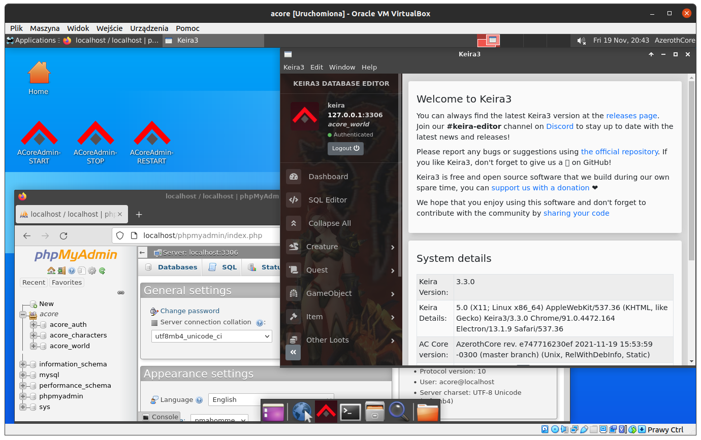

#  AzerothCore

# ACore Box

## Introduction
AzerothCore Box in short ACore Box is ready to go Virtual Machine with clean AzerothCore server.  
With this VM you will be able to run a local AzerothCore server for learning and testing purpouses.

## Download
https://mega.nz/file/JJh2QRhQ#cEZB4V5O-QHg_cyF-dZ3l3ewGVFQcP3x1fQ9Nh0wKvE  
Archive size: 6,2GB, uncompressed 25,6GB (VM disk size 30GB)

## HowTo - ACore Box manual
1. [VM creation](./howto/vm_create.md)  
2. [System Management](./howto/system_management.md)

## Installed components
OS: Ubuntu 20.04  
AzerothCore: rev 8668a03  
Keira3: 3.3.0  
MySQL: 8.0  
phpMyAdmin: 4.9.5  
Apache: 2.4.41  
PHP: 7.4.3  
XFCE: 4.16  
Web browser: FireFox    
OpenSSH-Server: 8.2  
Virtualbox Guest Additions

---

## ACore Box in action

---

### ACore Box was created with :heart: and passion.