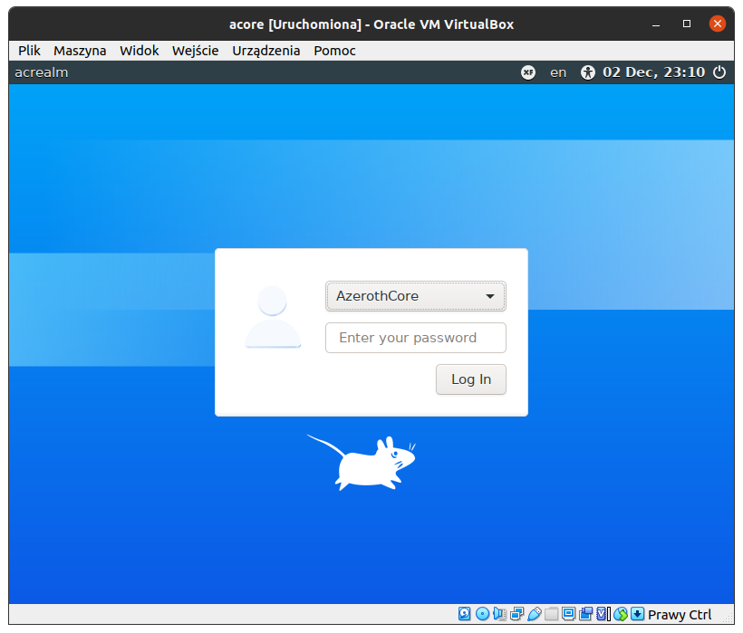
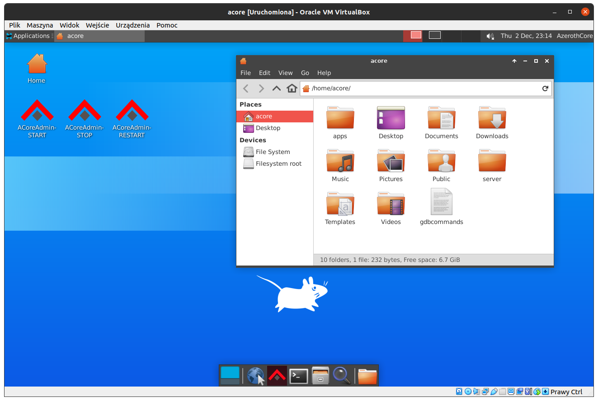
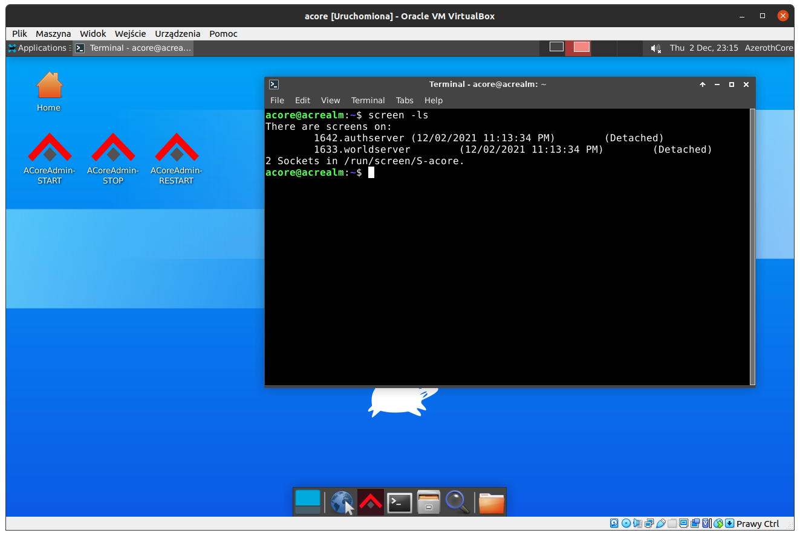
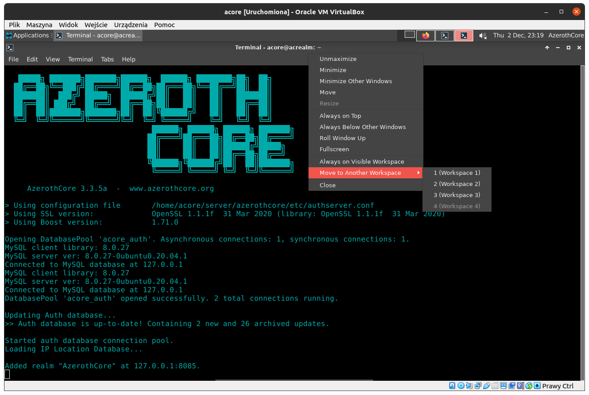
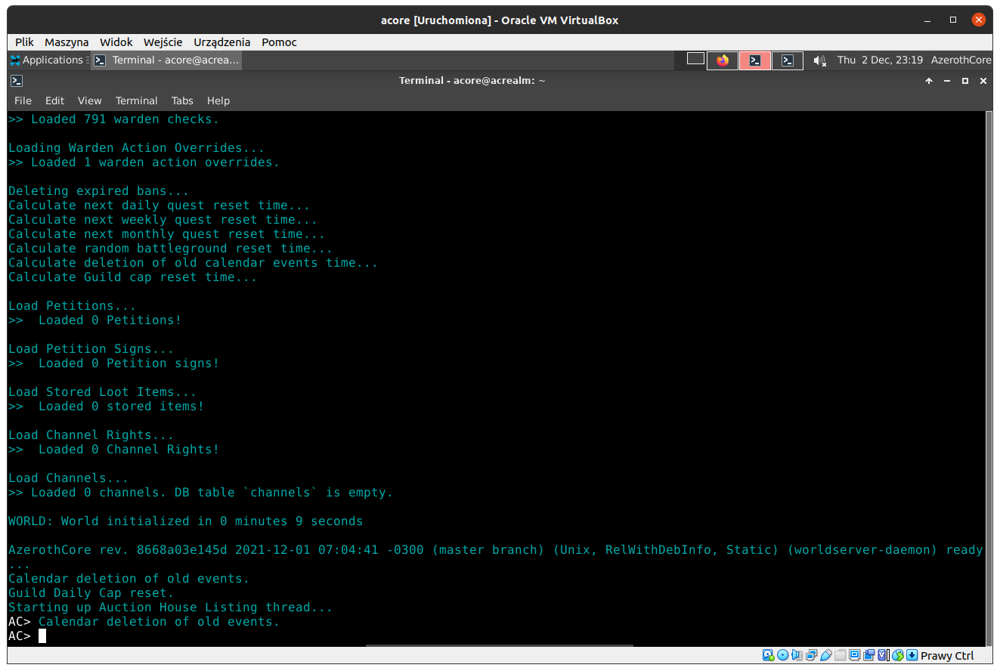
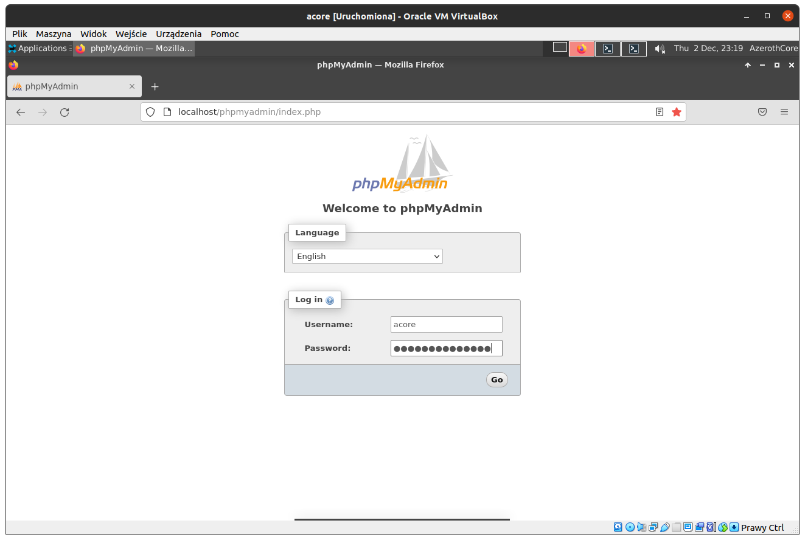
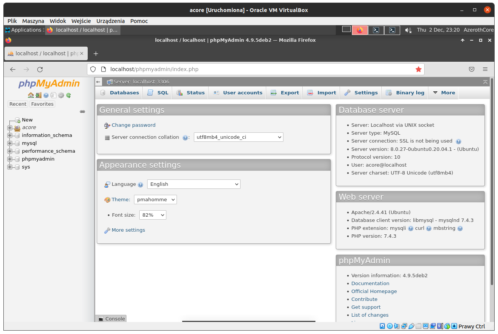

#  AzerothCore

# ACore Box

## OS Credentials
User: acore  
Password: Server1

Please change default user password to your own. User have sudo (administration privileges).

## Software direcotry
AzerothCore:
 - sources: /home/acore/server/src/
 - installation directory: /home/acore/server/azerothcore/

Addidtional software dir (/home/acore/apps/):
 - credentials file (you will find there logins and passwords for MySQL, phpMyAdmin etc.)
 - [Keira3](https://github.com/azerothcore/Keira3)
 - [acore-linux-restarter](https://github.com/nolt/acore-linux-restarter)


## General info
This image will not be updateded in future but don't be worry, Ubuntu 20.04 LTS have support till 2025. If you will use ACore Box for a long time you can also install system updates (system will inform you about new updates). Updates are not obligatory but will help you to keep your system up to date (also remember that sometimes updates includes seciurity fixes that must be installed asap). Also remember to update AzerothCore repository if needed.

If you are Linux user you can now skip reading this tutorial and start using ACore Box :smile:

## System management
Every time when you start ACore Box you will be welcomed with login manager. To login use credentials provided at the beginning of this tutorial, you have to type password only.



After login you will see your desktop you will find there:
- Home icon which is your home directory
- **acore-linux-restarter** icons to easly star/stop/restart your AzerothServer (tool is very handy it try to keep your server up and running, when you start yor server and process will be killed it will start that process again)
- bottom panel includes fast access to Firefox, Keira3, Terminal, Files and Search
- you have also access to four virtual desktops called **Workspace** (panel near speaker), their are very handy and will help you organize your work with system
TIP: to move window to another virtual desktop, right click on title bar of opened application and choose "Move to another workspace"



## AzerothCore management
For your convenience you can start/stop/restart AzerothCore server using desktop icons. After starting AC both auth and world server will be running in background using screen terminal application.  
To check they are running, open terminal and type:   
```
screen -ls
``` 



If you want to access server console open terminal and type:
- **auth server**
```
screen -r auth
```



TIP: to move window to another virtual desktop, right click on title bar and choose "Move to another workspace"
- **world server**
```
screen -r world
```



To leave console without killing running process in screen use key combination:
```
CTRL+A+D
```

If you will leave console with "CTRL+C" or "CTRL+D" **acore-linux-restarter** will automatically run again killed process.
You can use restarter via terminal typing:
```
~/apps/acoreadmin.sh
```
for more info about **acore-linux-restarter** please head to GIT - [acore-linux-restarter](https://github.com/nolt/acore-linux-restarter).

## Keira3
Keira3 is cross-platform desktop application featuring a **Database Editor** for the [AzerothCore MMORPG framework](http://www.azerothcore.org).  
For more info about **Keira3** please follow GIT - [Keira3](https://github.com/azerothcore/Keira3)

## MySQL management
ACore Box have installed phpMyAdmin - free software for managing MySQL through Web. Just open "Firefox", link is located at bookmarks panel (credentials are saved in browser, you will find them also in credentials file in apps folder).




