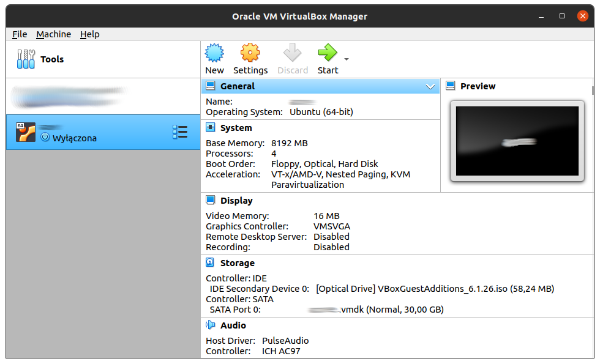
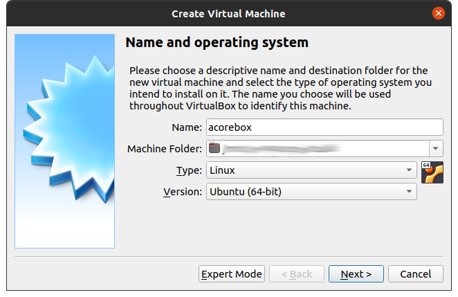
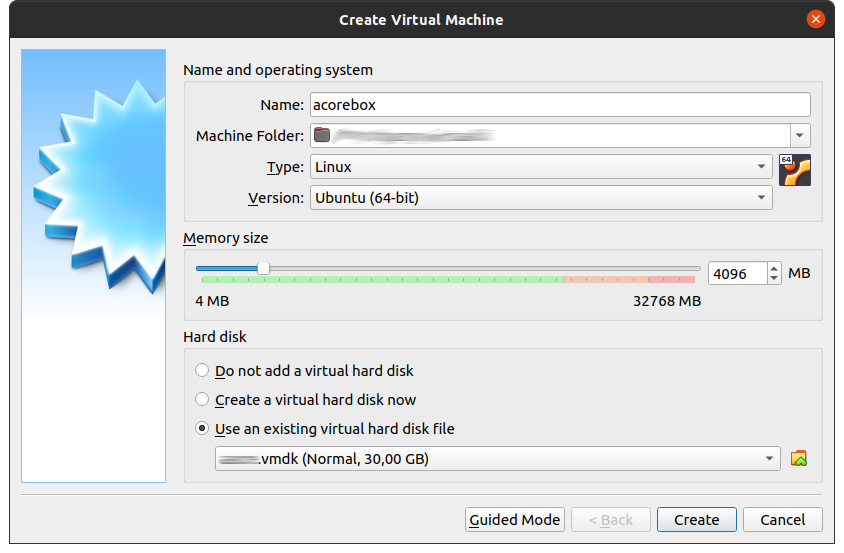
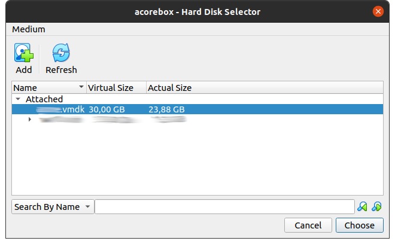
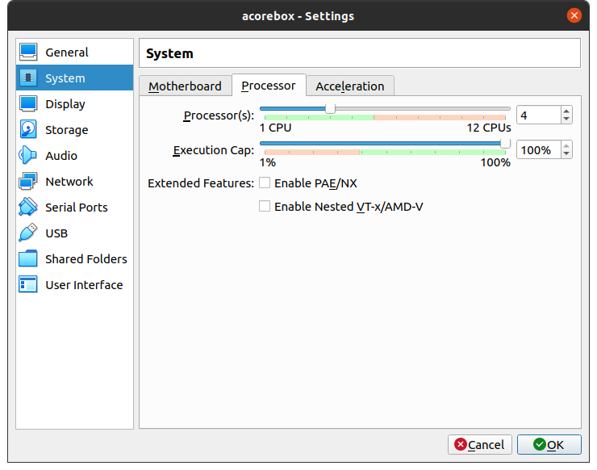
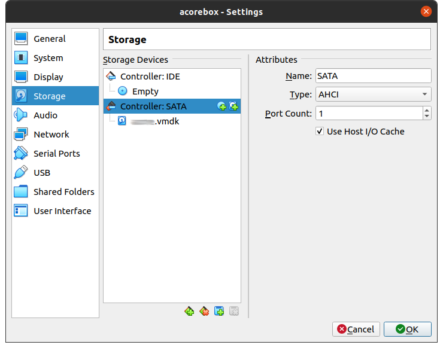
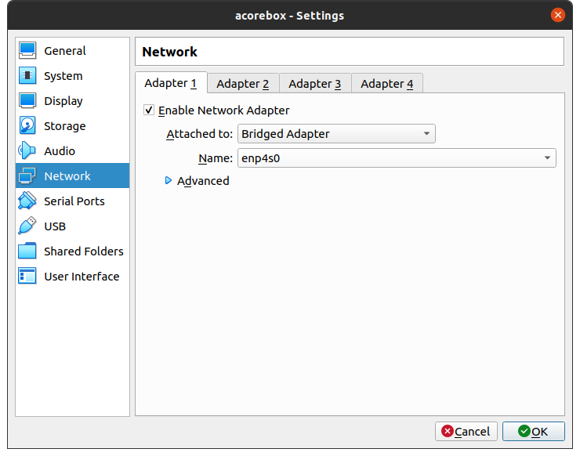

#  AzerothCore

# ACore Box

 ## OS Credentials
 User: acore  
 Password: Server1

Please change default user password to your own.

## Download

Archive size: 5,9GB, uncompressed 25,6GB (disk size 30GB)

## Creating VM
Extract downloaded archive to your disk. Remember to have 30GB free space on it.

1. Open VirtualBox and click New

2. In new window click "Expert Mode"

3. In Expert Mode
- choose name for your new VM
- use "Type" and "Version" of the OS as on screen below
- set "Memory size" minimum 4GB
- choose "Use an existing virtual hard disk file" and click orange folder

4. Click "Add" and browse extracted file acore-box.vmdk, after that you will be able to select your VM disk, next press "Choose"

5. You will be back to the first window with VM details, double check if everything is as on screen below and press "Create"

6. Select your new VM and click "Settings" icon 

7. Go to "System" section and choose "Processor" tab. Here you will be able to adjust number of CPU's (cores) for your VM.

8. Go to "Storage" section and select "Controller: SATA". For better disk performance mark "Use Host I/O Cache" checkbox.

9. Go to "Network" section and from "Attached to" dropdown menu choose "Bridged Adapter". This option allows your VM to get LAN IP address from your router DHCP. Be sure that you are connected with cable if not, choose "Name" and select your WiFi card instead Ethernet one. Settings should look very similar as screen below. After that click "OK" button.

10. Finally select your VM and press "Start" icon.

If you didn't make any mistakes with configuration you should see login screen to your Ubuntu Linux. Type password provided at the beginning of this tutorial.